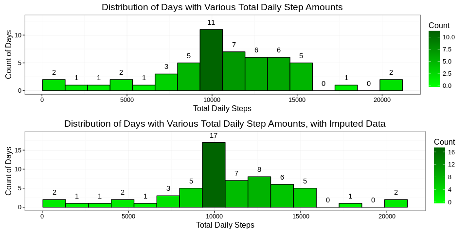
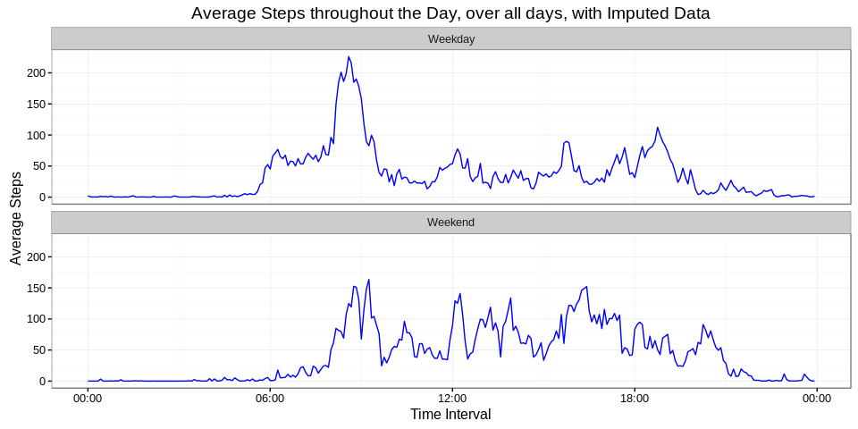

# Reproducible Research: Peer Assessment 1
Ben Kesseler  
May 10, 2016  
First, some libraries need to be called, and some settings set.


```r
knitr::opts_chunk$set(echo = TRUE)
libraries <- c("ggplot2",
               "knitr",
               "readr",
               "scales",
               "lubridate",
               "reshape",
               "gridExtra")
sapply(libraries,library,character.only=TRUE)
```

```
## 
## Attaching package: 'scales'
```

```
## The following objects are masked from 'package:readr':
## 
##     col_factor, col_numeric
```

```
## 
## Attaching package: 'lubridate'
```

```
## The following object is masked from 'package:base':
## 
##     date
```

```
## Loading required package: plyr
```

```
## 
## Attaching package: 'plyr'
```

```
## The following object is masked from 'package:lubridate':
## 
##     here
```

```
## 
## Attaching package: 'reshape'
```

```
## The following objects are masked from 'package:plyr':
## 
##     rename, round_any
```

```
## The following object is masked from 'package:lubridate':
## 
##     stamp
```

```
## $ggplot2
## [1] "ggplot2"   "stats"     "graphics"  "grDevices" "utils"     "datasets" 
## [7] "methods"   "base"     
## 
## $knitr
## [1] "knitr"     "ggplot2"   "stats"     "graphics"  "grDevices" "utils"    
## [7] "datasets"  "methods"   "base"     
## 
## $readr
##  [1] "readr"     "knitr"     "ggplot2"   "stats"     "graphics" 
##  [6] "grDevices" "utils"     "datasets"  "methods"   "base"     
## 
## $scales
##  [1] "scales"    "readr"     "knitr"     "ggplot2"   "stats"    
##  [6] "graphics"  "grDevices" "utils"     "datasets"  "methods"  
## [11] "base"     
## 
## $lubridate
##  [1] "lubridate" "scales"    "readr"     "knitr"     "ggplot2"  
##  [6] "stats"     "graphics"  "grDevices" "utils"     "datasets" 
## [11] "methods"   "base"     
## 
## $reshape
##  [1] "reshape"   "plyr"      "lubridate" "scales"    "readr"    
##  [6] "knitr"     "ggplot2"   "stats"     "graphics"  "grDevices"
## [11] "utils"     "datasets"  "methods"   "base"     
## 
## $gridExtra
##  [1] "gridExtra" "reshape"   "plyr"      "lubridate" "scales"   
##  [6] "readr"     "knitr"     "ggplot2"   "stats"     "graphics" 
## [11] "grDevices" "utils"     "datasets"  "methods"   "base"
```
***
## Loading and preprocessing the data

The original file provided was *activity.zip*. This code assumes that file is
in the working directory. The code will check for the presence of *activity.csv*,
and if not found, unzip the file *activity.zip*.

The code will then read in *activity.csv*, and convert the interval to a time.


```r
if (length(list.files(pattern="activity.csv")) == 0) {
        if (length(list.files(pattern="activity.zip")) == 0) {
                paste("Please put the file activity.zip in the working directory")
                } else {
                        unzip("activity.zip")
                        activity <- read_csv("activity.csv")
                        print("activity.zip found, unzipped, and read into item: activity")
                }
        } else {
                activity <- read_csv("activity.csv")        
                print("activity.csv found, read into item: activity")
                        
}
```

```
## [1] "activity.csv found, read into item: activity"
```

```r
activity$time <- strptime(sprintf("%04d",activity$interval),format="%H%M")
```
***
## What is the mean total number of steps taken per day?

First, the code will calculate the number of total steps per day, and store the 
result in a new data frame.


```r
activity.by.day <- aggregate(
        list(steps = activity$steps),
        by = list(date = activity$date),
        FUN =sum)
```

For this portion of the analysis, NA values are ignored.


```r
activity.by.day.clean <- subset(activity.by.day,!is.na(steps))
```

Next, a histrogram will be created to show the distribution of the total steps
per day.


```r
original.histogram <- ggplot(activity.by.day.clean,aes(steps))+
        geom_histogram(
                breaks=seq(min(activity.by.day.clean$steps,na.rm=TRUE),
                           max(activity.by.day.clean$steps,na.rm=TRUE),l=17),
                col="black",
                aes(fill=..count..)
                )+
        scale_fill_continuous("Count",low="green", high="dark green")+
        theme_bw()+
        stat_bin(
                breaks=seq(min(activity.by.day.clean$steps,na.rm=TRUE),
                           max(activity.by.day.clean$steps,na.rm=TRUE),l=17),
                geom="text", 
                aes(label=..count..), 
                vjust=-1)+
        expand_limits(y=c(0,13))+
        ggtitle("Distribution of Days with Various Total Daily Step Amounts")+
        labs(x="Total Daily Steps",y="Count of Days")

original.histogram
```


The mean and median of the total number of steps taken per day are:


```r
table.mean.and.median <- data.frame(Measurements = c("Mean","Median"),
                                    Values = c(
                                            mean(activity.by.day.clean$steps),
                                            median(activity.by.day.clean$steps)
                                    )
)
kable(table.mean.and.median)
```


Measurements      Values
-------------  ---------
Mean            10766.19
Median          10765.00
***
## What is the average daily activity pattern?

The data must first be aggregated by interval, time must be added for
plotting, and the time at which the maximum average daily steps occurs 
calculated.


```r
activity.by.interval <- aggregate(activity[,c("interval","steps")],
                                  by=list(activity$interval),
                                  FUN=mean,
                                  na.rm=TRUE)

activity.by.interval$time <- activity$time[1:288]

maximum.average.steps.time <- activity.by.interval$time[
        which(activity.by.interval$steps==max(activity.by.interval$steps))]
```

Now the code will plot the time series of average daily steps.


```r
ggplot(activity.by.interval,aes(x=time,y=steps))+
        geom_line(color="blue")+
        theme_bw()+
        labs(x="Time Interval",y="Average Steps")+
        geom_vline(xintercept=as.numeric(maximum.average.steps.time))+
        scale_x_datetime(labels=date_format("%H:%M",tz="America/Los_Angeles"))+
        ggtitle("Average Steps throughout the Day, over all days")+
        annotate("text",
                 x = maximum.average.steps.time+600,
                 y = max(activity.by.interval$steps),
                 label = paste("Maximum Average Daily Steps of ",
                               format(max(activity.by.interval$steps),digits=4),
                               "steps occurs at ",
                               format(maximum.average.steps.time,"%-H:%M")),
                 hjust=0
        )
```


The 5-minute interval from 8:35AM - 8:40AM has the highest average number of 
steps:


```r
format(max(activity.by.interval$steps),digits=4)
```

```
## [1] "206.2"
```

```r
format(maximum.average.steps.time,"%-H:%M")
```

```
## [1] "8:35"
```
***
## Imputing missing values

Missing values may be a problem. How many missing values are there, and how are
they distributed by time, day, and day of week?


```r
activity$day <- factor(weekdays(activity$date),c("Monday",
                                                 "Tuesday",
                                                 "Wednesday",
                                                 "Thursday",
                                                 "Friday",
                                                 "Saturday",
                                                 "Sunday"))

activity$daytype <- factor(activity$day %in% c("Monday",
                                               "Tuesday",
                                               "Wednesday",
                                               "Thursday",
                                               "Friday"),
                           levels=c(TRUE,FALSE),
                           labels=c('Weekday', 'Weekend'))

activity$hour <- hour(activity$time)

activity$missing <- is.na(activity$steps)

with(activity,xtabs(missing ~ daytype + hour))
```

```
##          hour
## daytype    0  1  2  3  4  5  6  7  8  9 10 11 12 13 14 15 16 17 18 19 20
##   Weekday 72 72 72 72 72 72 72 72 72 72 72 72 72 72 72 72 72 72 72 72 72
##   Weekend 24 24 24 24 24 24 24 24 24 24 24 24 24 24 24 24 24 24 24 24 24
##          hour
## daytype   21 22 23
##   Weekday 72 72 72
##   Weekend 24 24 24
```

So there are missing values for every hour and every day type.

How many missing value are there, overall?


```r
print(paste("Total missing values:",sum(activity$missing)))
```

```
## [1] "Total missing values: 2304"
```

```r
print(paste("% of values missing:",
            percent(sum(activity$missing)/length(activity$steps))))
```

```
## [1] "% of values missing: 13.1%"
```

So we need to impute the missing values. I'm going to use the average value for
the type of day (weekday or weekend) and the hour in question. How many values
will I be using to impute the missing values?


```r
with(activity,xtabs(!missing ~ daytype + hour))
```

```
##          hour
## daytype     0   1   2   3   4   5   6   7   8   9  10  11  12  13  14  15
##   Weekday 468 468 468 468 468 468 468 468 468 468 468 468 468 468 468 468
##   Weekend 168 168 168 168 168 168 168 168 168 168 168 168 168 168 168 168
##          hour
## daytype    16  17  18  19  20  21  22  23
##   Weekday 468 468 468 468 468 468 468 468
##   Weekend 168 168 168 168 168 168 168 168
```

That's reasonable, in terms of how many non-missing values I'll be using to
impute the missing values.


```r
activity.nomissing <- subset(activity,!is.na(steps))
activity.bydaytype.byhour <- cast(
        activity.nomissing[,c("daytype","hour","steps")],
        daytype ~ hour,value="steps",mean)
activity.bydaytype.byhour <- melt(activity.bydaytype.byhour,id.vars=c("daytype"))
activity.preimpute <- merge(activity,activity.bydaytype.byhour)
activity.postimpute <- activity.preimpute

for (i in 1:nrow(activity.postimpute)) {
        if (activity.postimpute$missing[i] == TRUE) {
                activity.postimpute$revised_steps[i] <- activity.postimpute$value[i]
        } else {
                activity.postimpute$revised_steps[i] <- activity.postimpute$steps[i]
                }
}

activity.postimpute <- activity.postimpute[,c("date","time","interval","daytype","hour","revised_steps")]
```

Now we need to create a histogram of the new data.

First, the code will calculate the number of total steps per day, and store the 
result in a new data frame.


```r
activity.by.day.fixed <- aggregate(
        list(revised_steps = activity.postimpute$revised_steps),
        by = list(date = activity.postimpute$date),
        FUN =sum)
```

And for the histogram


```r
imputed.histogram <- ggplot(activity.by.day.fixed,aes(revised_steps))+
        geom_histogram(
                breaks=seq(min(activity.by.day.fixed$revised_steps,na.rm=TRUE),
                           max(activity.by.day.fixed$revised_steps,na.rm=TRUE),l=17),
                col="black",
                aes(fill=..count..)
                )+
        scale_fill_continuous("Count",low="green", high="dark green")+
        theme_bw()+
        stat_bin(
                breaks=seq(min(activity.by.day.fixed$revised_steps,na.rm=TRUE),
                           max(activity.by.day.fixed$revised_steps,na.rm=TRUE),l=17),
                geom="text", 
                aes(label=..count..), 
                vjust=-1)+
        expand_limits(y=c(0,19))+
        ggtitle("Distribution of Days with Various Total Daily Step Amounts")+
        labs(x="Total Daily Steps",y="Count of Days")

grid.arrange(original.histogram, imputed.histogram, ncol=1)
```



The mean and median of the total number of steps taken per day are:


```r
table.mean.and.median.2 <- data.frame(Measurements = c("Original Mean",
                                                       "Imputed Mean",
                                                       "Original Median",
                                                       "Imputed Median"),
                                    Values = c(
                                            mean(activity.by.day.clean$steps),
                                            mean(activity.by.day.fixed$revised_steps),
                                            median(activity.by.day.clean$steps),
                                            median(activity.by.day.fixed$revised_steps)
                                    )
)
kable(table.mean.and.median.2)
```


Measurements         Values
----------------  ---------
Original Mean      10766.19
Imputed Mean       10762.05
Original Median    10765.00
Imputed Median     10571.00

So the mean and median didn't shift a lot, which is encouraging.

***

## Are there differences in activity patterns between weekdays and weekends?


```r
activity.by.interval.2 <- aggregate(revised_steps ~ interval + daytype,data=activity.postimpute[,c("daytype","interval","revised_steps")],
                                  FUN=mean,
                                  na.rm=TRUE)

activity.by.interval.2$time <- activity$time[1:288]
```

Now the code will plot the time series of average daily steps.


```r
ggplot(activity.by.interval.2,aes(x=time,y=revised_steps))+
        geom_line(color="blue")+
        theme_bw()+
        labs(x="Time Interval",y="Average Steps")+
        scale_x_datetime(labels=date_format("%H:%M",tz="America/Los_Angeles"))+
        ggtitle("Average Steps throughout the Day, over all days")+
        facet_wrap(~daytype,nrow=2)
```


